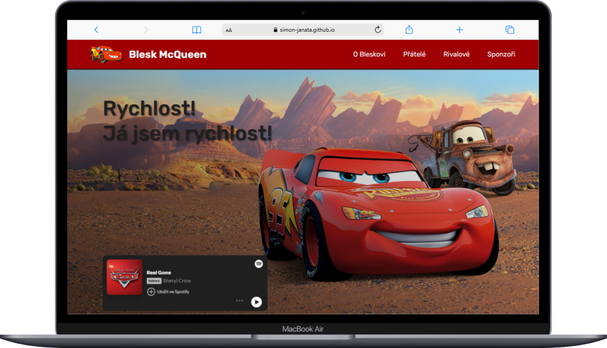
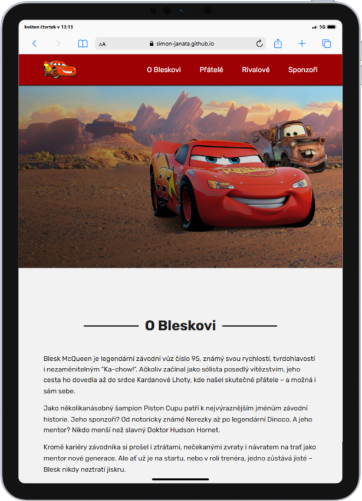
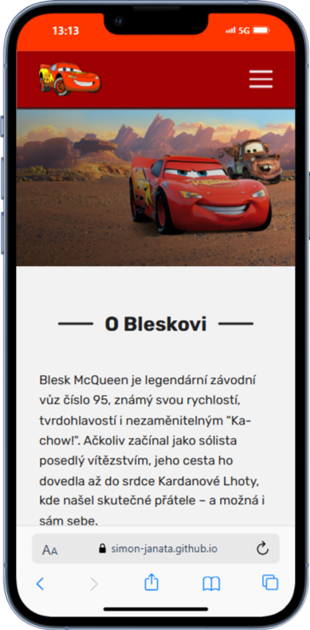

# ⚡ Lightning McQueen Fan Website

This is a fan-made responsive website about Lightning McQueen, created as a project for the ITW course at FIT VUT Brno.

  
  
  

---

## 🚗 About the Project

This project showcases information about the character Lightning McQueen from the *Cars* franchise by Pixar.  
It includes sections like:

- About Lightning McQueen
- Friends and Rivals
- Sponsors
- Famous Quotes
- Responsive hamburger navigation

---

## 🛠️ Technologies Used

- HTML5 + SCSS
- Vanilla JavaScript
- Responsive Design using Media Queries
- Font Awesome Icons
- WebP image optimization

---
